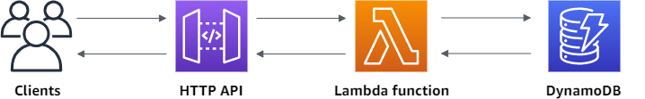

# Portfolio Node.js Application

This is a Node.js application developed as a part of a test for Zemoga. It allows users to view and edit their portfolios.
this app use AWS DynamoDB to get the list of the user portfolios in the index page and the portfolio details page.
The edit form and the save process use AWS ApiGateWay with AWS Lambda as serverless backend.

## Installation

Follow these steps to install and run the application:

1. Clone the repository: `git clone https://github.com/yourusername/portfolio_nodejs.git`
2. Navigate to the project directory: `cd portfolio_nodejs`
3. Install the dependencies: `npm install`
4. Start the server: `npm start`

The application will be running at `http://localhost:3000`.

## Features

- View a list of portfolios
- View the details of a portfolio
- Edit a portfolio

## Technologies Used

- Node.js
- Express.js
- Pug (for views)
- AWS DynamoDB (for data storage)

Please replace `yourusername` with your actual GitHub username in the `git clone` command.